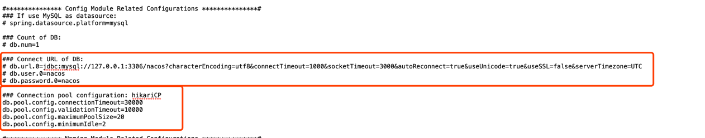

# Nacos 注册中心

[下载地址](https://github.com/alibaba/nacos/releases/download/2.0.4/nacos-server-2.0.4.tar.gz)

[本地默认地址](http://localhost:8848/nacos/index.html)

默认用户名：nacos 默认密码：nacos

## 一、nacos默认是集群模式

1. 单机部署需要将集群模式修改为单机模式 linux修改bin目录下的startup.sh文件 windows修改bin目录下的startup.com文件
   

2. 修改数据源，nacos默认数据源是存在内存当中，可以通过修改application.properties文件把数据源改为Mysql
   

3. 系统启动nacos，需先cd到bin目录下