## vue文件构建

### 1.添加行容器：点击或拖拽添加所需数量的行容器

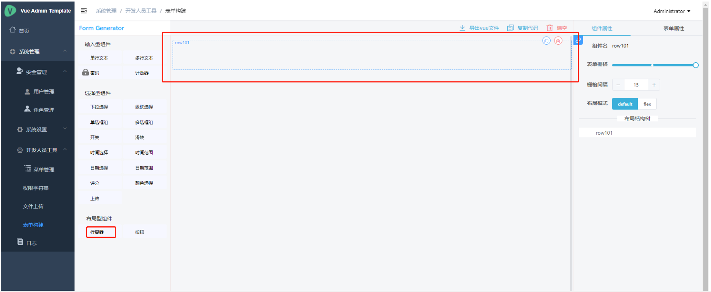

要求每一行都要有行容器

### 2.添加表单组件：通过点击或拖拽的方式向行容器内添加所需种类和数量的表单组件

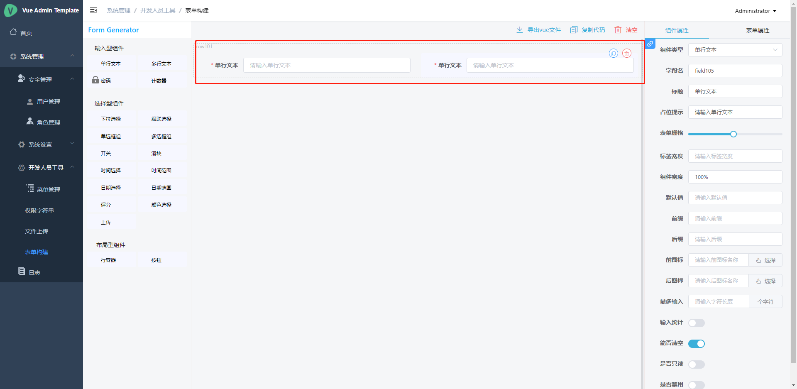

### 3.配置表单组件：

3.1配置组件属性
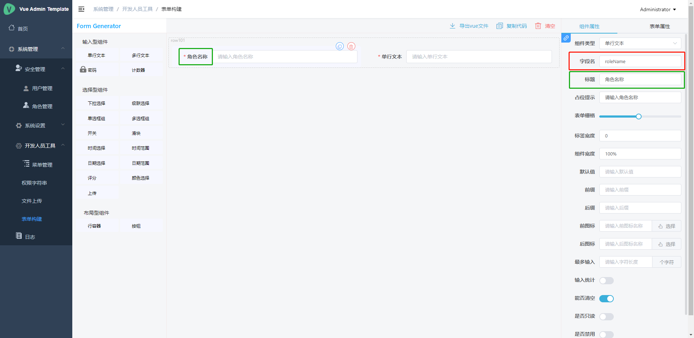

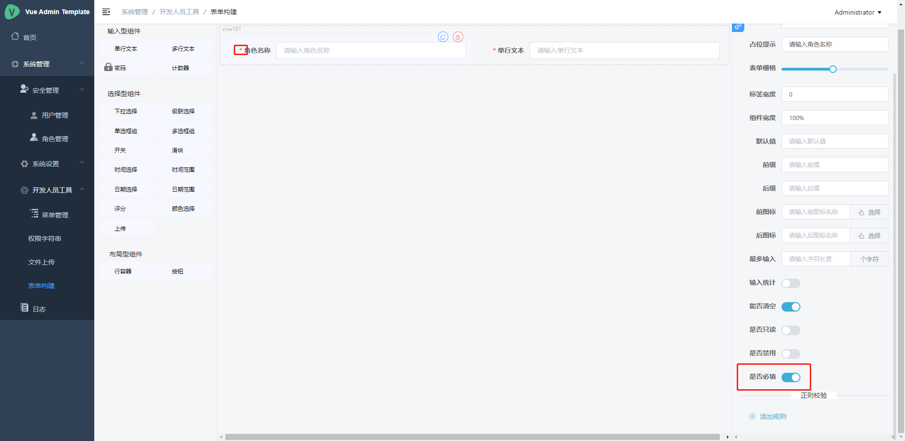

（1）.配置字段名：与接口字段名相同（用数据库对应的字段名）

（2）.配置标题

（3）.配置是否必填

（4）.根据所需配置正则检验规则：要求公共校验规则提出来，仅自己用的校验规则可不提！！！

3.2配置表单属性

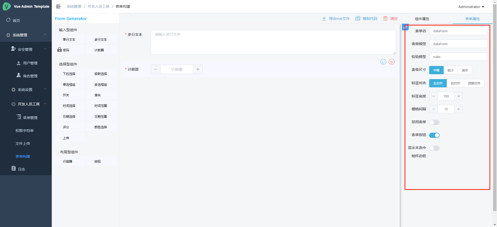

如果没有特殊要求，这边不用改，表单名对应的是表单的ref，表单模型对应的是表单的model。

## vue文件使用

### 1.配置props:

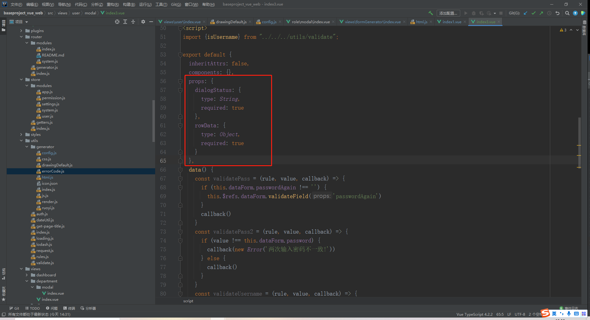

根据需要配置props，实例页面由于需要dialogStatus判断是新增还是编辑所以多传了一个dialogStatus，如果只是一个功能的页面就只需传入rowData。

### 2.配置dataForm：

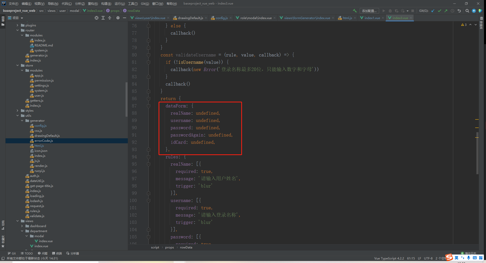

根据需要配置dataForm，上图展示为页面只新增时的dataForm情况，即生成时的代码，可以不做修改，也可以将undefined修改为对应的数据类型，比如字符用“”、list用[]，所以不建议修改，因为undefined可以是任何类型

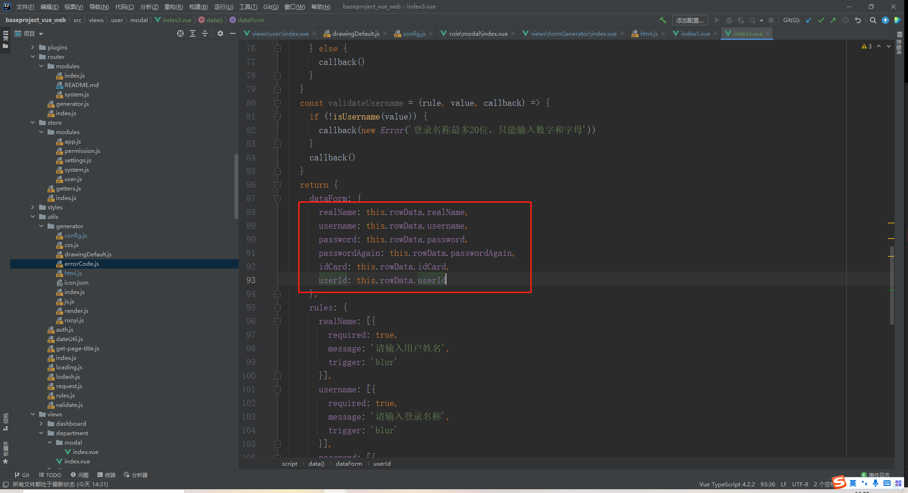

上图展示为页面编辑或新增编辑时的dataForm情况，生成代码后需要将dataForm逐项配置。

### 3.配置校验规则：

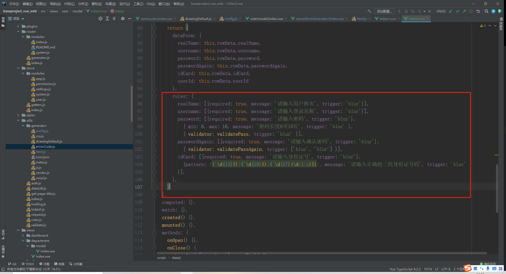

要求仅自己使用的校验规则仅放在自己的页面，公共的校验规则提出到公共的rules.js中

### 4.配置methods：

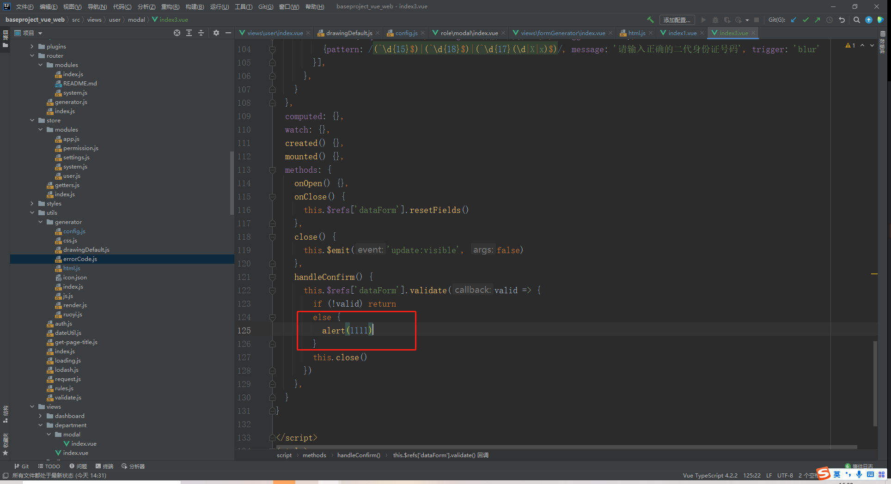

图一为生成代码后的methods，图二为修改部分，即在校验通过后想要执行的方法，比如调用父组件的提交方法。

要求子组件不再调用接口，接口调用全部由父组件执行！！！

### 5.配置其他方法：

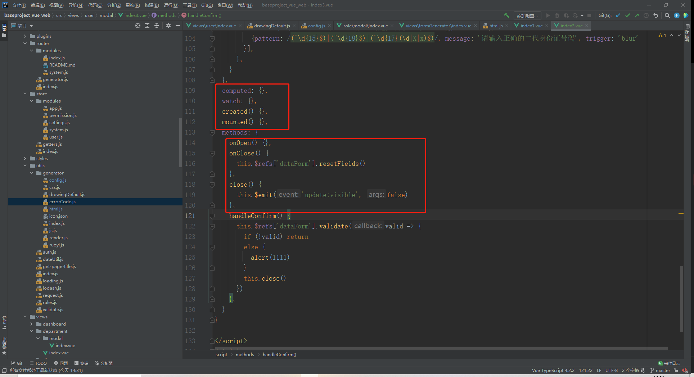

一般来说，这些都不用改，除非有特殊需要。

