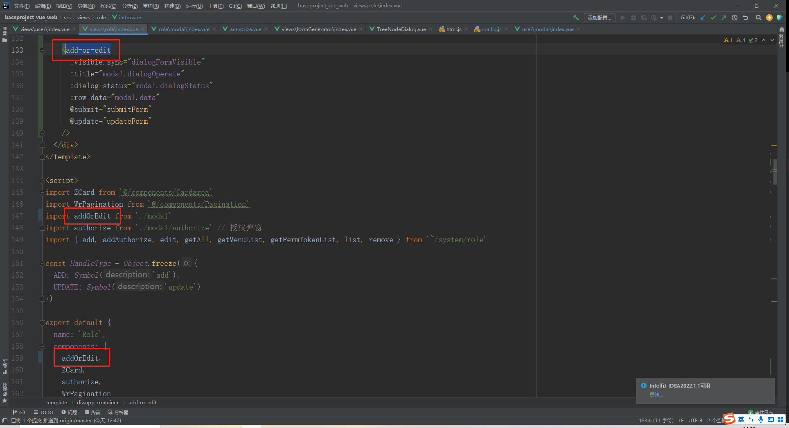
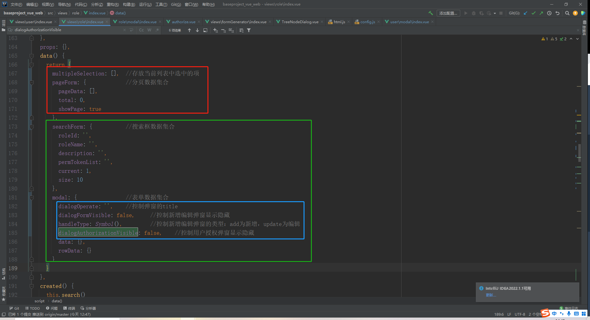

1.新增与编辑页子组件统一名称：add-or-edit

2.data()中相同类型数据放在同一数据集合中

红框中为系统默认项，基本不用改，如果页面中表格不带多选功能将multipleSelection删掉；

绿框中字段根据所需修改；要求蓝框内必须加注释！！！

3.子组件接父组件传的数据集合统一用字段rowData，子组件内部使用的数据集合统一用字段dataForm

这样生成出来的代码几乎就不用改了